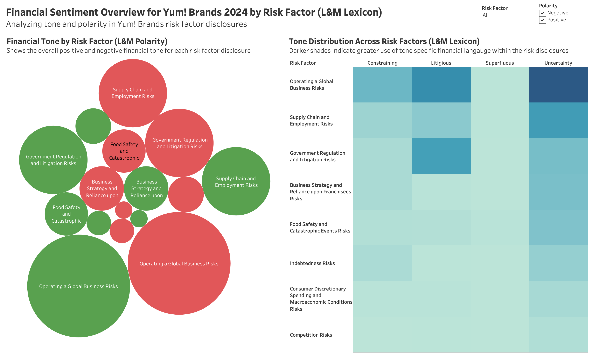
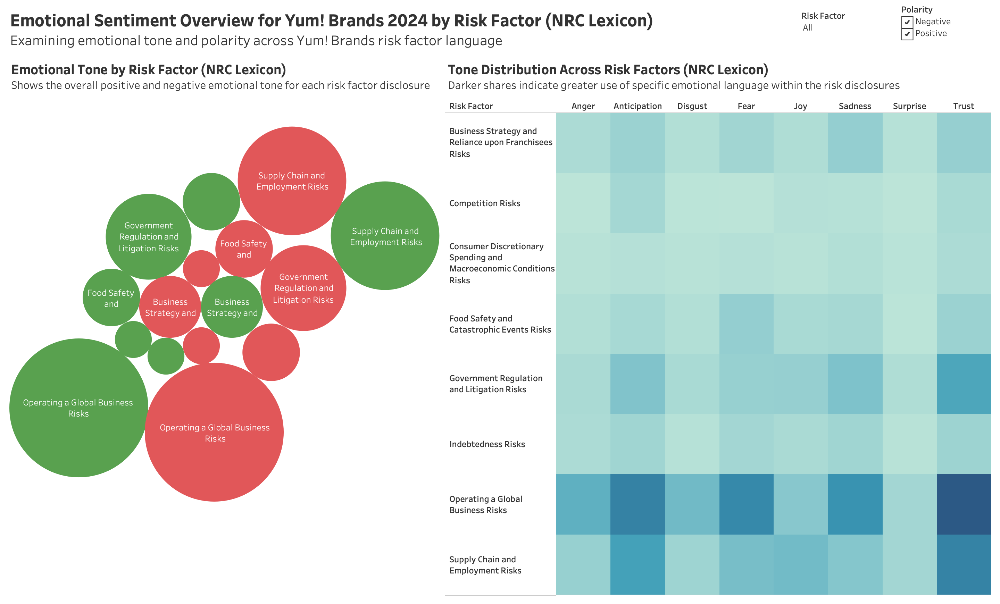
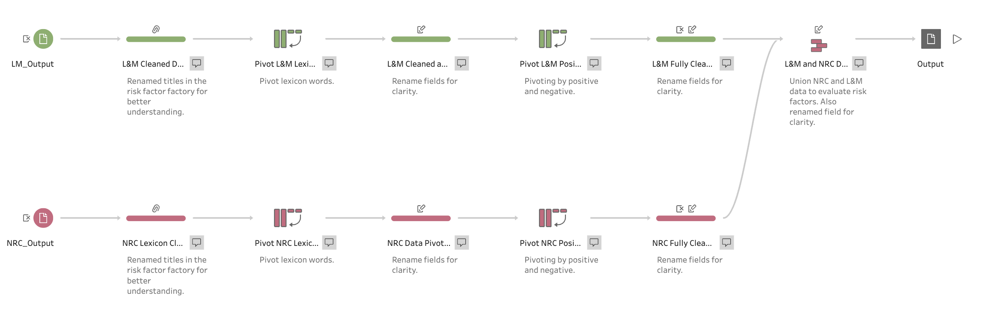

# Yum! Brands 10-K Sentiment Analysis (R + Tableau)




## Project Overview

This project analyzes the **sentiment and emotional tone of risk factor disclosures in Yum! Brands’ 2024 Form 10-K** using financial text analytics. The analysis combines **R for sentiment classification**, **Tableau Prep Builder for data preparation**, and **Tableau for visualization** to evaluate how corporate risk language communicates caution, transparency, and confidence to stakeholders.

Two established sentiment lexicons were applied:

* **Loughran & McDonald Financial Sentiment Dictionary** – financial tone used in accounting research
* **NRC Emotion Lexicon** – emotional sentiment classification

The project demonstrates how **programming, data preparation tools, and visualization platforms can be integrated to analyze corporate financial disclosures.**

---

## Tools & Technologies

* **R** – sentiment analysis using financial and emotional lexicons
* **Tableau Prep Builder** – data preparation and transformation
* **Tableau Desktop** – dashboard development and visualization
* **Microsoft Excel** – intermediate dataset formatting

---

## Methodology

### 1. Sentiment Analysis in R

R was used to perform text analysis on Yum! Brands’ 2024 10-K risk factor disclosures.

The text was tokenized and matched with two sentiment dictionaries:

**Loughran & McDonald Financial Sentiment Dictionary**

* Negative
* Positive
* Uncertainty
* Litigious
* Constraining

**NRC Emotion Lexicon**

* Trust
* Anticipation
* Fear
* Anger
* Joy
* Surprise
* Sadness
* Disgust

The resulting dataset contained word-level sentiment classifications that were exported for further processing.

---

### 2. Data Preparation with Tableau Prep



Tableau Prep Builder was used to structure the sentiment dataset for visualization by:

* Importing sentiment output from R
* Cleaning and organizing the dataset
* Aggregating sentiment counts
* Structuring the dataset for Tableau dashboards

---

### 3. Visualization with Tableau

Tableau was used to build an interactive dashboard highlighting sentiment distribution across the 10-K risk factor sections.

---

## Key Insights

**Financial Tone (Loughran & McDonald)**
The analysis reveals a strong presence of **uncertainty and negative language**, reflecting the cautious nature of risk disclosures in corporate filings.

**Emotional Sentiment (NRC)**
The most prominent emotional signals were **anticipation and trust**, suggesting forward-looking language and management confidence in addressing risks.

--

## Repository Structure

```
├── README.md
├── dashboard/
├── images/
└── prep/
```

---

## Skills Demonstrated

* Financial text analytics
* Sentiment analysis in **R**
* Data preparation with **Tableau Prep Builder**
* Data visualization with **Tableau**
* Analysis of corporate financial disclosures

---

